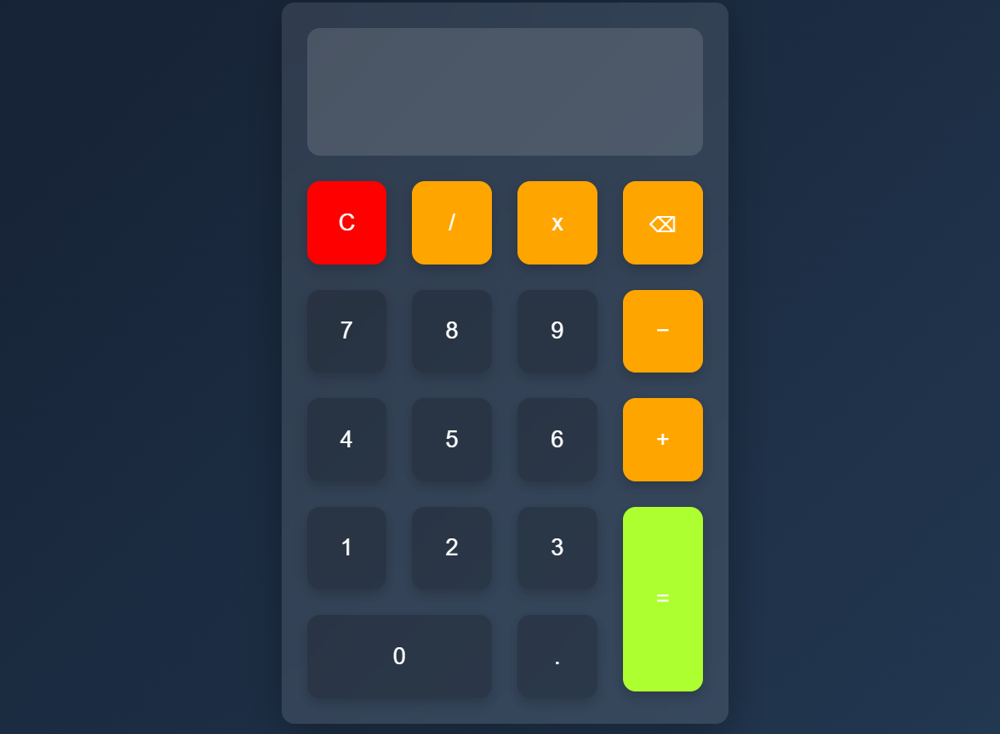

# Modern Calculator Web Application

A modern and interactive calculator web application developed using HTML, CSS, and JavaScript. The application performs basic arithmetic operations through a clean and visually appealing user interface featuring a glassmorphism design. Users can perform calculations dynamically without refreshing the page.

## Features

* Perform Addition, Subtraction, Multiplication, and Division
* Interactive calculator interface
* Dynamic calculations using JavaScript
* Clear all input functionality
* Delete last entered character
* Decimal number support
* Responsive button layout using CSS Grid
* Modern glassmorphism user interface
* Lightweight and fast-loading application

## Technologies Used

* HTML5
* CSS3
* JavaScript (Vanilla JS)

## Project Structure

```text
Calculator/
│
├── calculator.html
│
└── Image/
    └── screenshot.png
```

## Screenshots

### Application Interface



## How to Run

1. Download or clone the repository.
2. Open `calculator1.html` in any modern web browser.
3. Use the calculator buttons to enter numbers and operators.
4. Click the `=` button to calculate the result.
5. Use the `C` button to clear the display.
6. Use the `⌫` button to remove the last entered character.

## Purpose

This project was developed to practice front-end web development concepts such as JavaScript functions, event handling, DOM manipulation, arithmetic operations, CSS Grid layouts, and modern UI design using HTML, CSS, and JavaScript.

## Learning Outcomes

Through this project, developers can gain experience in:

* JavaScript Functions
* Arithmetic Operations
* Event Handling
* DOM Manipulation
* Dynamic Content Updates
* CSS Grid Layout
* Responsive Design
* Front-End Development Fundamentals

## Future Enhancements

* Add keyboard input support
* Implement calculation history
* Add scientific calculator functions
* Improve mobile responsiveness
* Add dark and light themes
* Prevent invalid mathematical expressions
* Add percentage and square root operations
* Store calculation history using Local Storage

## Author

**Malla Venkata Varun Teja**

B.Tech in Computer Science and Engineering

Software Engineering Fresher seeking opportunities in the IT industry to apply and strengthen skills in web development, software engineering, and problem-solving.